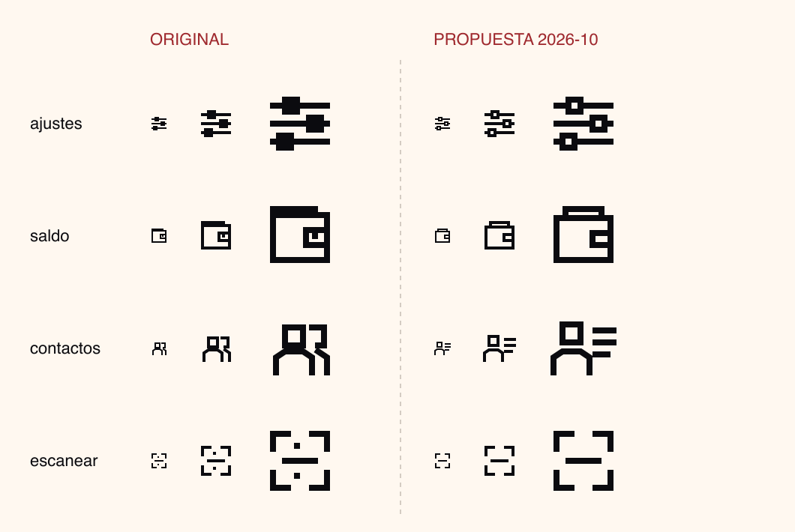

# Propuesta: cuatro iconos corregidos

**Estado:** pendiente de aprobación. Los iconos vigentes siguen en `../svg/`.

Mismas reglas que la familia: retícula de 24, trazo de 2, remates cuadrados y `currentColor`.

| Icono | Problema del original | Corrección |
|---|---|---|
| `ajustes` | Las líneas atraviesan los mandos y a tamaño pequeño parecen bloques rellenos | Las líneas se cortan en cada mando, que queda hueco |
| `saldo` | Doble marco y un punto relleno: pesa más que el resto | Cartera de un solo marco, una tarjeta asomando y un bolsillo sin relleno |
| `contactos` | Dos figuras solapadas que no se distinguen a 24 px | Una figura y tres líneas de lista |
| `escanear` | Dos puntos sueltos que vibran a tamaño pequeño | Cuatro esquinas y la línea de lectura |

**Si se aprueban:** copiar `svg/*.svg` sobre `../svg/`, ejecutar `npm run brandkit:social` (los posts `consejo-04` y `acciones-02` se actualizan solos) y validar el kit.
